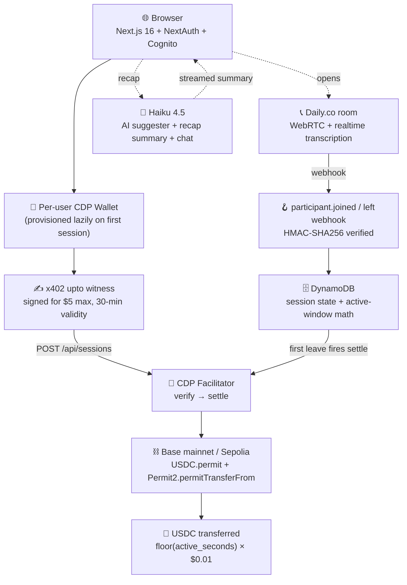

# PayPhone

> **Per-second video billing on Base.** A buyer-side AI agent authorizes "up to $5"
> via x402's `upto` scheme, opens a Daily.co video room with a human expert, and
> settles the actual call duration in **one on-chain Permit2 USDC transfer**. The
> buyer never holds ETH; the facilitator pays gas; the unspent allowance never
> moves.

[](https://basescan.org/address/0xE01669A01E28E905055Ac6cD33c19ced7e10d870)
[](https://docs.cdp.coinbase.com/x402/welcome)
[](https://nextjs.org)
[](https://docs.cdp.coinbase.com)
[](https://aws.amazon.com/amplify/)
[](https://easya.io)

🎥 **Watch the demo →** **<https://youtu.be/V8pga7SQjxE>** &nbsp;·&nbsp; 🔗 **Live app →** **<https://main.d3vbs5akc8zis2.amplifyapp.com>**


<!-- TODO: replace with docs/screenshots/01-hero.png — landing page hero, signed-out, dark mode, 1280x640 -->

---

## Table of contents

- [TL;DR](#tldr)
- [Live demo](#live-demo)
- [The pitch](#the-pitch)
- [Quick start](#quick-start)
- [Architecture](#architecture)
- [Tech stack](#tech-stack)
- [On-chain proof](#on-chain-proof)
- [Product tour](#product-tour)
- [How it works](#how-it-works)
- [Why x402 + `upto` specifically](#why-x402--upto-specifically)
- [Repository layout](#repository-layout)
- [Scripts](#scripts)
- [Testing](#testing)
- [Future work / known limitations](#future-work--known-limitations)
- [Acknowledgments](#acknowledgments)
- [License](#license)

## TL;DR

> _An AI agent authorizes a per-second-billed expert call. One signature, one
> on-chain settlement, gas-sponsored. Stripe physically can't do this._

- **What:** PayPhone bills per-second video sessions with human experts and
  settles the actual call duration in a single on-chain USDC transfer on Base.
- **Why this is interesting:** Stripe's 30¢ + 2.9% minimum makes per-second
  billing impossible. x402's `upto` scheme + Permit2 lets a buyer sign for
  "up to $5" once, and the chain enforces "actual amount used ≤ $5" without
  trust.
- **Who pays gas:** the CDP facilitator, via EIP-2612 + `erc20ApprovalGasSponsoring`.
  The buyer never holds ETH on Base.
- **Demo proof:** 6 real on-chain settlements (2 on Base mainnet), the latest
  a 31-second call settling $0.31 in one tx, gas-free for the buyer.
- **Built for:** EasyA Consensus Miami 2026, Agentic Track (Coinbase + AWS).

## Live demo

> _Sign in with Cognito, get a per-user CDP wallet, drip-fund it from the in-app
> Sepolia faucet, and run a real two-tab call that settles on-chain._

🔗 **<https://main.d3vbs5akc8zis2.amplifyapp.com>**

The deployed app runs on **Base Sepolia** (production safe-default — no real
money moved by visitors). Mainnet is reachable from a local laptop env-flip;
see the [On-chain proof](#on-chain-proof) section for the two real-money
mainnet settlements.

**To try a session yourself:**

1. Sign up at the live URL via Cognito Hosted UI (email + password, you'll
   get a verification code).
2. After sign-in, your per-user CDP wallet is provisioned lazily on first
   action. The marketplace shows a **Wallet panel** with your address +
   USDC balance.
3. If your balance is $0.00, click **Fund my wallet** — the CDP faucet drips
   10 Sepolia USDC. (CDP has a 24h project-wide quota; if it's exhausted,
   the panel surfaces the [Circle faucet](https://faucet.circle.com/) URL
   as a manual fallback.)
4. Click **Talk to ...** on any expert card. A Daily room opens. Open the
   same `/session/<id>` URL in a second tab/incognito to act as the expert.
5. Talk for ~30 seconds, click **End call & settle**. Within ~10s the recap
   page renders with the AI summary, follow-up chat, and a working BaseScan
   link to the on-chain settlement.

## The pitch

> _Three lines. Don't drift._

**1. Stripe physically can't do this.** Stripe's per-transaction minimum is
30¢ + 2.9%. A 12-second call billed at $0.12 would lose money before the
merchant sees a cent. Per-second billing isn't a UX problem — it's a
payment-rail problem.

**2. x402 + `upto` turns per-second billing into one on-chain settlement.**
The buyer signs ONE EIP-712 witness saying "I authorize up to $5.00, valid
for 30 minutes." The proxy contract enforces `amount ≤ permitted.amount`
on-chain via `AmountExceedsPermitted`. When the call ends, the server
settles for `floor(active_window_seconds) × $0.01`. The unspent allowance
never moves — no refund path, no leftover state.

**3. The video call is the demo. The rail is the product.** Anyone can
build "a video app." The novel surface is the autonomous payment that
authorizes ahead of time, settles after, and never charges more than the
user agreed to. The agent shows up with an API key, not an ETH-funded
EOA. CDP's facilitator pays the gas via `eip2612GasSponsoring` and
`erc20ApprovalGasSponsoring` extensions declared in the 402 challenge.

## Quick start

> _Clone, install, env, run. ~5 minutes if you have AWS + CDP + Daily creds in hand._

```bash
git clone https://github.com/Achyut21/payphone.git
cd payphone
pnpm install
```

Create `.env.local` at the project root with the following keys (placeholder
values shown — get real ones from the dashboards listed):

```dotenv
# Coinbase Developer Platform — https://portal.cdp.coinbase.com
CDP_API_KEY_ID=<your_cdp_api_key_id>
CDP_API_KEY_SECRET=<your_cdp_api_key_secret>
CDP_WALLET_SECRET=<your_cdp_wallet_secret>

# AWS DynamoDB (after `terraform apply` in infra/terraform/)
APP_AWS_REGION=us-east-1
APP_AWS_ACCESS_KEY_ID=<terraform output app_access_key_id>
APP_AWS_SECRET_ACCESS_KEY=<terraform output app_secret_access_key>
DYNAMODB_TABLE_NAME=payphone-sessions
USERS_TABLE_NAME=payphone-users

# AWS Cognito — populated from `terraform output` in infra/terraform/cognito.tf
COGNITO_CLIENT_ID=<terraform output cognito_user_pool_client_id>
COGNITO_CLIENT_SECRET=<terraform output cognito_user_pool_client_secret>
COGNITO_ISSUER=<terraform output cognito_issuer>

# NextAuth v5
NEXTAUTH_URL=http://localhost:3000
NEXTAUTH_SECRET=<openssl rand -base64 32>

# Daily.co — https://dashboard.daily.co
DAILY_API_KEY=<your_daily_api_key>
DAILY_WEBHOOK_SECRET=<set after running register-daily-webhook.ts>

# Anthropic — https://console.anthropic.com
ANTHROPIC_API_KEY=<your_anthropic_api_key>

# Network selection — defaults to sepolia (safe). Set to "mainnet" for real-money runs.
NEXT_PUBLIC_ACTIVE_NETWORK=sepolia
INTERNAL_API_URL=http://localhost:3000
```

**One-time AWS infra:**

```bash
brew install terraform awscli
aws configure                                   # paste a temporary AdministratorAccess key
cd infra/terraform
terraform init
terraform apply                                 # provisions DDB + Cognito + scoped IAM
terraform output                                # copy values into .env.local
```

**Run it:**

```bash
pnpm dev                                        # http://localhost:3000
```

For the full local flow including Daily webhook tunneling (you'll need
ngrok), see the [How it works](#how-it-works) section below.

## Architecture

> _Browser → NextAuth+Cognito → per-user CDP wallet signs an x402 `upto`
> witness → CDP facilitator settles on Base via Permit2 (gas sponsored).
> Daily.co handles video; DynamoDB stores session state; Anthropic Haiku 4.5
> powers the AI suggester and the post-call summary._

For an **animated, scroll-driven version** of this diagram, visit the
**[/docs page](https://main.d3vbs5akc8zis2.amplifyapp.com/docs)** in the live
deploy — SVG paths self-draw on viewport entry with a "data flowing" pulse on
each edge.

The static fallback (rendered by GitHub):



The settlement amount is `floor(active_window_seconds) × $0.01`, capped at
the signed `upto.amount`. **Active window** = the time both participants
were in the room — buyer wait time before the expert joined doesn't count.
See [`lib/billing.ts`](./lib/billing.ts) for the pure-function math.

## Tech stack

> _Coinbase + AWS + Anthropic, glued together with Next.js 16 and TypeScript strict._

| Layer           | Technology                                                  | Role                                                                       |
| --------------- | ----------------------------------------------------------- | -------------------------------------------------------------------------- |
| **App runtime** | Next.js 16 App Router, React 19.2, TypeScript strict        | SSR + edge proxy + API routes (all `runtime = 'nodejs'` for CDP SDK)       |
| **Styling**     | Tailwind v4, shadcn/ui, Lucide React, Aceternity components | Dark-mode design system, Aurora + BeamsWithCollision + Spotlight           |
| **Animation**   | `motion` (rebranded framer-motion v12)                      | The scroll-driven `/docs` flowchart, in-call pulse animations              |
| **Auth**        | AWS Cognito Hosted UI + NextAuth v5                         | Sign-up + sign-in via Cognito User Pool; JWT session strategy              |
| **Wallets**     | Coinbase CDP Server Wallets v2                              | One CDP wallet per Cognito user, provisioned lazily on first action        |
| **Payments**    | x402 v2 via CDP facilitator + Permit2 + EIP-2612            | `upto` scheme; gas-sponsored via `eip2612GasSponsoring` extension          |
| **Settlement**  | Base mainnet / Base Sepolia, USDC                           | One on-chain Transfer event per call, the actual duration × $0.01          |
| **Video**       | Daily.co rooms + Deepgram realtime transcription            | WebRTC video; client-captured transcript POSTed to the server              |
| **Persistence** | AWS DynamoDB (Terraform-managed)                            | Two tables: `payphone-sessions`, `payphone-users` (cognito_sub → wallet)   |
| **AI**          | Anthropic Claude Haiku 4.5 via Vercel AI SDK v6             | AI expert suggester (one-shot); recap summary + follow-up chat (streaming) |
| **Hosting**     | AWS Amplify Hosting                                         | Production deploy with `amplify.yml` build spec; runtime IAM scoped to DDB |
| **IaC**         | Terraform (Cognito + DDB + IAM)                             | One `terraform apply` provisions the auth + persistence layer              |

### Coinbase tech callout

PayPhone uses Coinbase Developer Platform end-to-end on the agent side:

- **CDP Server Wallets v2** — every user gets their own server-managed
  wallet via `cdp.evm.getOrCreateAccount({ name })`. Idempotent — calling
  twice with the same name returns the same address, which makes our
  race-safe lazy provisioning trivial.
- **CDP x402 facilitator** — the `/verify` and `/settle` endpoints are
  hosted by CDP. We hand-roll the 402 → verify → settle handshake (rather
  than using `paymentMiddleware`) because settlement must wait until call
  hangup.
- **`@x402/core`, `@x402/evm`, `@x402/fetch`** — the protocol-v2 packages
  with `UptoEvmScheme` for the buyer-side signing and `eip2612GasSponsoring`
  for gas-free first-time Permit2 approval.
- **USDC on Base** — Circle's production USDC at `0x833589fC...02913`. We
  validated against both Sepolia and mainnet contracts; the EIP-712 domain
  `name` differs (`"USDC"` Sepolia vs `"USD Coin"` mainnet) and is keyed
  per-network in [`lib/constants.ts`](./lib/constants.ts).

### AWS tech callout

Three AWS services, all Terraform-provisioned:

- **Amazon Cognito** — User Pool + Hosted UI domain + confidential web app
  client. NextAuth v5's Cognito provider handles the OAuth code flow.
- **Amazon DynamoDB** — `payphone-sessions` (hash key `session_id`, with
  TTL on `expires_at`) and `payphone-users` (hash key `cognito_sub`).
  On-demand billing.
- **AWS Amplify Hosting** — production deploy. The `amplify.yml` pins
  Node 22 + pnpm 10.33 + writes a `.env.production` at build time so SSR
  runtime can read Console-set env vars (Amplify doesn't auto-forward env
  vars to Next's runtime, and reserves the `AWS_*` prefix for itself; we
  use `APP_AWS_*` aliases in the app code).

### Anthropic tech callout

**Claude Haiku 4.5** powers two distinct features:

- **AI expert suggester** (`app/api/experts/suggest/route.ts`) — one-shot
  non-streaming JSON response. The user types "I'm stuck on a Solidity
  gas issue", Haiku picks the best-matching seeded expert + writes a
  one-line reason. Direct `@anthropic-ai/sdk` call.
- **Streaming recap + follow-up chat** (`lib/haiku.ts`) — Vercel AI SDK's
  `streamText` for token-by-token rendering. The system prompt pins the
  call transcript so chat answers are grounded in what was actually said.
  Falls back to a specialty-only summary if the transcript is empty
  (e.g., the second tab never joined).

## On-chain proof

> _Six real on-chain settlements. Two on Base mainnet, four on Sepolia. Same
> code path. Buyer paid no gas on any of them — the CDP facilitator did._

| #   | Milestone    | Network     | Function                  | Amount         | What it proved                                                                       | BaseScan                                                                                                                    |
| --- | ------------ | ----------- | ------------------------- | -------------- | ------------------------------------------------------------------------------------ | --------------------------------------------------------------------------------------------------------------------------- |
| 1   | M1           | Sepolia     | `exact`                   | $0.10          | x402 round-trip on the CDP facilitator works end-to-end                              | [`0xc09fa4bf…7c47bc`](https://sepolia.basescan.org/tx/0xc09fa4bf006b1937b7efc66e54725e02b55c992ac9bb9cd9f99d2492817c47bc)   |
| 2   | M2           | Sepolia     | `upto`                    | $0.30 of $5.00 | Asymmetric verify/settle, contract-enforced via `AmountExceedsPermitted`             | [`0x3b2625f0…4f09cd1`](https://sepolia.basescan.org/tx/0x3b2625f01acfb4a2b583e76a6441da9d1dfef4defb06a51873a2f36534f09cd1)  |
| 3   | M3           | Sepolia     | `upto` (88s × $0.01)      | $0.88          | Daily.co + DDB + duration-derived settle (no UI yet)                                 | [`0xfc70cf0c…29e781`](https://sepolia.basescan.org/tx/0xfc70cf0cc0f9142897c79c1a44ce7cf18bc20ccc7050f48b96e95d59ea29e781)   |
| 4   | M4           | Sepolia     | `upto` (84.84s × $0.01)   | $0.84          | Browser flow end-to-end: marketplace → call → recap, 61 transcript lines             | [`0x47dab9fe…39d6e33a`](https://sepolia.basescan.org/tx/0x47dab9fe331741037730c4da1e1c1d46f2cfd5309db4311b3d57745739d6e33a) |
| 5   | M6 warm-up   | **Mainnet** | `Settle With Permit` (5s) | **$0.05**      | EIP-2612 gas sponsorship works first-try on Base **mainnet**                         | [`0x59ab4719…4d4dd8`](https://basescan.org/tx/0x59ab47194669f93ce8a6a94ee6a288e55d42c2727b4b3c3f805ad50a034d4dd8)           |
| 6   | M6 rehearsal | **Mainnet** | `settle` (plain, 31s)     | **$0.31**      | Residual-allowance settle path — architecture self-optimizes between the two flavors | [`0x95b4eba8…d14116`](https://basescan.org/tx/0x95b4eba8639be5809fa7cb9f7a32ea78ddd1d33efaf0a4c7a4724207acd14116)           |

**M4.9 active-window QA** (no canonical hash — multiple ad-hoc settles): a
9-scenario QA pass on Sepolia validated active-window billing math (buyer
wait time isn't billed; ticker freezes when either party leaves; idempotent
under at-least-once webhook delivery). Each scenario produced its own
settle tx; all matched `floor(active_window_seconds) × $0.01`.

**Buyer wallet (consistent across all six):**
[`0xE01669A01E28E905055Ac6cD33c19ced7e10d870`](https://basescan.org/address/0xE01669A01E28E905055Ac6cD33c19ced7e10d870)
— Achyut's CDP wallet, funded with $5 USDC at M0.

**Seller wallet:** `0x5c15772fd9132F2EaaCe0c55638fB674b0BaFC71` —
`payphone-seller`, the demo recipient.

**CDP facilitator (paid all the gas):**
`0x8F5cB67B49555E614892b7233CFdDEBFB746E531`.

**x402UptoPermit2Proxy:** `0x4020A4f3b7b90ccA423B9fabCc0CE57C6C240002` —
the `...0002` vanity address, same on every EVM chain.

### Why two function names?

The on-chain function alternates depending on the buyer's residual Permit2
allowance for USDC at the moment of settle:

- **`Settle With Permit`** fires when residual Permit2 allowance <
  `upto.amount`. The CDP facilitator bundles a USDC EIP-2612 permit (which
  tops the allowance up by `upto.amount`) plus a
  `Permit2.permitTransferFrom` (which takes the actual settle amount) into
  a single tx. Both calls facilitator-paid.
- **`settle`** (plain) fires when the residual allowance is already
  enough. Just the `Permit2.permitTransferFrom`. Same single
  facilitator-paid tx, cheaper gas.

From the buyer's UX, both flavors are identical — one signature, no
manual approve, no buyer ETH. Once cumulative spend drains the residual
allowance below the `upto.amount`, the next settle fires `Settle With
Permit` again to top up.

## Product tour

> _Eight surfaces, one flow. Sign-out → sign-in → marketplace → AI
> suggester → live call → recap. Mobile and desktop._

### Landing page (`/`)

Public marketing page with `BackgroundBeamsWithCollision`, how-it-works
3-card breakdown, a server-fetched **live last-call widget** showing the
most recent settled session, and a built-on-by badge row.


<!-- TODO: replace with docs/screenshots/01-hero.png — landing page hero, signed-out, dark mode, 1280x720 -->

### Login (`/login`)

Cognito Hosted UI sign-in card with the Aceternity Spotlight background
and PayPhone-tuned gradients. Click "Sign in with Cognito" → bounces to
Cognito Hosted UI for email + password (or sign-up if new) → returns to
`/marketplace`.


<!-- TODO: replace with docs/screenshots/02-login.png — login page, dark mode, 1280x720 -->

### Marketplace (`/marketplace`)

Cognito-gated. Four seeded experts in a responsive grid (1/2/3 col across
sm/md/lg). The wallet panel above the grid polls
`/api/users/me/balance` every 8s and conditionally renders **"Fund my
wallet"** when the balance < $5 on Sepolia. Network badge in the navbar
(orange = Sepolia, green = mainnet).


<!-- TODO: replace with docs/screenshots/03-marketplace.png — signed in, wallet panel visible, expert grid, 1280x900 -->

### AI suggester moment

The free-form chat input above the expert grid sends to
`/api/experts/suggest`, which calls Haiku 4.5 to pick the best-matching
seeded expert. The chosen card gets a payphone-orange border tint, a
"Suggested" badge with the model's reason, and the page smooth-scrolls
to the match.


<!-- TODO: replace with docs/screenshots/04-suggester.png — AI suggester filled in, "Suggested" badge on Alice Chen card, 1280x900 -->

### Live session (`/session/<id>`)

Daily.co iframe rendering, live billing ticker counting up at $0.01/sec
in the sticky sidebar (desktop) or a sticky mini-bar (mobile), in-call
transcript streaming both speakers, a pulsing **ON AIR** badge in the
top-right of the video pane.


<!-- TODO: replace with docs/screenshots/05-session.png — live call, ticker mid-count, ON AIR badge visible, 1280x800 -->

### Recap (`/session/<id>/recap`)

Settle status card with a pulsing **"Settled on-chain"** badge, the big
mono `$X.XX · m:ss` display, a BaseScan link in a payphone-orange chip,
and the Haiku-streamed AI summary in markdown. Below: a follow-up chat
box that answers questions grounded in the captured transcript.


<!-- TODO: replace with docs/screenshots/06-recap.png — recap with settle status + streaming AI summary, 1280x900 -->


<!-- TODO: replace with docs/screenshots/07-recap-chat.png — recap with follow-up chat exchanged, 1280x900 -->

### Docs page (`/docs`)

The animated architecture flowchart self-draws on viewport entry. Same
content as the [Architecture](#architecture) section above plus the
Why-These-Choices callouts and the on-chain proof grid.


<!-- TODO: replace with docs/screenshots/08-docs.png — /docs page with the animated flowchart at full extent, 1280x900 -->

### Mobile (375px)

Single-column marketplace, wallet panel stacked above the expert cards,
and the in-call sticky `$X.XX` mini-bar that floats over the iframe when
scrolled. 44×44 hamburger button (Apple HIG-compliant), 1.5px
custom-themed scrollbars.

| Marketplace                                                                                            | Live session                                                                                        |
| ------------------------------------------------------------------------------------------------------ | --------------------------------------------------------------------------------------------------- |
|  |  |

<!-- TODO: replace with docs/screenshots/09-mobile-marketplace.png + 10-mobile-session.png at 375×812 each -->

## How it works

> _Three steps. Browse → Talk → Settle. The agent does the signing; the
> chain does the enforcement; the human does the talking._

### 1. Browse — AI suggests an expert

The user types a free-form prompt ("I'm stuck on a Solidity gas
optimization issue"). `POST /api/experts/suggest` calls Haiku 4.5 with
the four seeded experts as context; the model returns
`{ expertId, reason }`. The matching card highlights, the page scrolls.

If the user prefers to pick manually, they just click any card. The AI
suggester is opt-in.

### 2. Talk — Daily room with a live billing ticker

Clicking **Talk to ...** runs the `startSession` server action:

```
Browser
  └─► server action (Next.js 16)
        └─► lib/agent.ts: requestSession({ userId, expertId, topic })
              └─► getUserBuyerAccount(userId)         (lazy CDP wallet)
              └─► POST /api/sessions
                    ├─► verify (CDP facilitator: x402 upto, $5 max)
                    ├─► createRoom (Daily REST, 30-min exp, max 2 participants)
                    ├─► createSession (DynamoDB, status: AUTHORIZED)
                    └─► return { sessionId, roomUrl, maxAuthorized }
        └─► redirect to /session/<id>
```

The session page mints a Daily meeting token with
`canAdmin: 'transcription'` and renders the iframe. Realtime
transcription captures both speakers; the local participant POSTs each
line to `/api/sessions/[id]/transcript` (with a de-dup filter — Daily
broadcasts to all tabs, only the local-participant tab persists). The
ticker counts from the moment `participant.joined` for the SECOND
participant lands — buyer wait time isn't billed.

### 3. Settle — one on-chain transfer at hangup

When either participant leaves, Daily fires `participant.left` to
`/api/webhooks/daily`. The handler:

1. Verifies HMAC-SHA256 against `DAILY_WEBHOOK_SECRET`.
2. Appends the event to the session's `participant_events[]`.
3. Recomputes the active-window via `lib/billing.ts` pure functions.
4. On first window-close, fires `settleWithRetry` (3 attempts: 2s, 5s,
   10s) with `amount = floor(active_seconds) × M3_PER_SECOND_RATE_ATOMIC`.
5. The CDP facilitator submits the on-chain tx (one of `Settle With
Permit` or plain `settle` depending on residual Permit2 allowance).
6. `markSessionCompleted` flips DDB conditionally on
   `status = AUTHORIZED ∨ ACTIVE` so duplicate webhooks no-op.
7. The buyer's `/status` poll sees `COMPLETED` →
   `router.push('/recap')`.

The recap page streams the Haiku summary and exposes the BaseScan link.
Total round-trip from "End call" click to recap render: ~5–15 seconds.

## Why x402 + `upto` specifically

> _Four design choices that surprised us. Each is a "we tried the obvious
> alternative first, here's why it didn't work" story._

### Why not Stripe (the pitch)

Stripe's per-transaction minimum is **30¢ + 2.9%**. A 12-second call billed
at $0.12 would cost the merchant 32.6¢ in fees against a 12¢ revenue —
margin negative before the merchant sees a cent. Per-second billing isn't
a UX problem. It's a payment-rail problem. The only way to fix it is to
batch (charge once for an estimated amount) or to settle on a rail with
sub-cent fees. PayPhone does the latter — Base mainnet gas is fractions
of a cent, and the CDP facilitator pays it.

### Why `upto`, not `exact`

The `exact` x402 scheme requires the buyer to know the price in advance.
We don't — duration is whatever the call ends up being. With `upto`, the
buyer signs an "I'll spend at most $5" Permit2 witness; the
x402UptoPermit2Proxy contract enforces `amount <= permitted.amount`
on-chain via `AmountExceedsPermitted`. Unspent allowance never moves;
the chain doesn't care that we asked for less than we authorized. M2's
on-chain proof: signed for $5, settled $0.30, $4.70 simply expired.

### Why hand-rolled, not `paymentMiddleware`

CDP's `paymentMiddleware` / `withX402` middleware settles at request
time. We need to defer settlement until the call hangs up — that's the
entire pitch. Hand-rolling the 402 → verify → settle dance lets `verify`
run when the buyer signs (synchronous, fail-fast on bad payment) but
`settle` run from the Daily.co `participant.left` webhook (asynchronous,
with the actual duration in hand). The middleware is great for static
paywalls; it's wrong for time-metered services.

### Why Permit2 + EIP-2612 gas sponsorship

Two USDC schemes are available on EVM: EIP-3009 (`transferWithAuthorization`)
and Permit2 (`signatureTransfer`). EIP-3009 is fixed-amount: signing for
$5 means $5 moves, period. Permit2 supports underspend: the witness says
"up to $5," the actual transfer can be any value $0 ≤ x ≤ $5. There is
no other primitive on EVM that lets a single signature authorize a range
and the chain enforce the cap.

The buyer-side agent signs without holding ETH because CDP's facilitator
declares `eip2612GasSponsoring` + `erc20ApprovalGasSponsoring` extensions
in the 402 challenge. The buyer signs a USDC EIP-2612 permit + the
Permit2 witness, and the facilitator combines them into a single
sponsored transaction. The buyer wallet stays gas-free. This is what
makes "no-wallet AI agents" work for the consumer side — they show up
with an API key, not a funded EOA.

## Repository layout

```
app/                                  Next.js 16 App Router
  page.tsx                            Public marketing landing
  marketplace/page.tsx                Cognito-gated expert browse + wallet panel
  docs/page.tsx                       Public technical writeup w/ animated flowchart
  login/page.tsx                      NextAuth Cognito sign-in card
  session/[id]/page.tsx               Live call page (Daily iframe + ticker)
  session/[id]/recap/page.tsx         Post-call summary + chat
  session/[id]/timeout/page.tsx       No-expert-joined timeout page
  api/auth/[...nextauth]/route.ts     NextAuth handlers
  api/sessions/route.ts               x402-protected session creation
  api/sessions/[id]/{status,recap,
    chat,transcript,retry-settle}/    Per-session API routes (ownership-gated)
  api/users/me/{balance,faucet}/      Wallet panel API
  api/experts/suggest/route.ts        Haiku 4.5 expert picker
  api/webhooks/daily/route.ts         Daily participant.{joined,left,ended} → settle
lib/
  constants.ts                        ALL chain/contract constants — keyed per-network
  cdp.ts                              CDP client singleton
  x402.ts                             facilitator client + retry settle
  daily.ts                            Daily REST + webhook HMAC + meeting tokens
  db.ts                               DynamoDB doc client + session/user CRUD
  agent.ts                            requestSession — the buyer flow
  user-wallet.ts                      Lazy per-user CDP wallet provisioning
  session-auth.ts                     requireSessionOwner ownership guards
  billing.ts                          Active-window math (pure, idempotent, commutative)
  haiku.ts                            Anthropic streaming summary + chat
  seed.ts                             Seeded experts (DEMO_EXPERTS)
components/                           UI components (Navbar, SessionRoom, Recap, etc.)
infra/terraform/                      AWS infra-as-code (Cognito + DDB + IAM)
scripts/                              Diagnostic + admin scripts
```

## Scripts

```bash
pnpm dev            # next dev (Turbopack)
pnpm build          # next build
pnpm lint           # eslint
pnpm format         # prettier --write
pnpm format:check   # prettier --check (CI-friendly)
pnpm test           # tsx --test scripts/test-active-window.ts
```

The pre-commit drill is `pnpm lint && pnpm format && pnpm build && pnpm test` —
keep those green before pushing.

Diagnostic scripts under `scripts/`:

| Script                      | What it does                                                                                                         |
| --------------------------- | -------------------------------------------------------------------------------------------------------------------- |
| `wallet-setup.ts`           | Resolves the buyer CDP wallet (idempotent)                                                                           |
| `fund-check.ts`             | Reads buyer USDC + ETH balance; `--top-up --target=N` faucet loop                                                    |
| `buyer-agent.ts`            | Drives the x402 round-trip end-to-end from the CLI                                                                   |
| `register-daily-webhook.ts` | Idempotent register/replace of the Daily webhook (deletes any stale webhooks pointing at our path)                   |
| `inspect-session.ts`        | Reads a DDB session row by id; prints BaseScan URL when settled; `--transcript`/`-t` dumps captured transcript lines |
| `migrate-achyut.ts`         | One-time DDB row linking the demo Cognito sub → existing M0-funded wallet                                            |
| `probe-supported.ts`        | Lists the (scheme, network) pairs the CDP facilitator advertises                                                     |
| `probe-usdc.ts`             | Reads `name`/`version`/`DOMAIN_SEPARATOR` etc. from USDC on-chain                                                    |
| `verify-tx.ts`              | Inspects a tx receipt + decodes USDC `Transfer` events                                                               |
| `test-active-window.ts`     | Unit tests for `lib/billing.ts` active-window math + settle-amount cap. Run via `pnpm test`.                         |

## Testing

> _8 unit tests under Node 22's built-in test runner. Zero new runtime deps.
> ~100ms total. Plus a 9-scenario manual QA matrix (M4.9) covering all
> participant-leave permutations._

| #   | Test                                                                  | Verifies                                                                                                      |
| --- | --------------------------------------------------------------------- | ------------------------------------------------------------------------------------------------------------- |
| 1   | empty events → window never opens                                     | An empty event log returns `{start_ms: undefined, end_ms: undefined}`                                         |
| 2   | single participant only → window never opens                          | One participant joining alone never opens the window — buyer is not billed for waiting                        |
| 3   | two participants normal flow → opens at 2nd join, closes at 1st leave | Canonical case. Pre-expert wait time is **not** billed                                                        |
| 4   | out-of-order events → identical result                                | Daily's webhooks are at-least-once and unordered — feeding events reverse must produce the same window math   |
| 5   | three participants → 1st pair opens, 1st-below-2 closes               | Window opens at count first reaching 2 (not 3); closes when count first drops below 2 (not when room empties) |
| 6   | settle amount cap → duration × rate clamps at upto MAX                | `computeSettleAmount(durationSec)` clamps at `M2_UPTO_MAX_ATOMIC` ($5) regardless of duration                 |
| 7   | idempotent under duplicate events                                     | Re-applying the same `joined` event twice is a no-op (Set-replay) — duplicates do not inflate duration        |
| 8   | open but not closed → uses `nowMs` as running end                     | Drives the live client ticker — the running duration uses the supplied `nowMs` while the window is still open |

```bash
pnpm test       # 8/8 should pass in ~100ms
```

## Future work / known limitations

> _What we'd build next if the hackathon had more hours._

- **Federated Cognito sign-out.** Our `signOut()` clears the NextAuth session
  cookie but doesn't kill the Cognito Hosted UI session. A user who clicks
  "Sign out" then "Sign in" sees themselves auto-signed-back-in. Fix: append
  Cognito's `/logout?logout_uri=...` redirect into the sign-out flow.
- **Per-expert variable rates.** Every expert currently bills $0.01/sec
  uniformly. The seed data has a `displayRate` field that's purely
  marketing copy. To make rates real, plumb a `per_second_rate_atomic`
  through `seed.ts → agent.ts → /api/sessions verify → settle`. About 3
  hours of work.
- **Bootstrap IAM cleanup (post-hackathon).** Terraform was bootstrapped
  with an `AdministratorAccess` IAM user `payphone-bootstrap`. The
  runtime user `payphone-app` is already DDB-only-scoped. Deleting the
  bootstrap user's access key revokes the leak surface.
- **Real expert side.** Currently a single user logs in and pretends to
  be both buyer and expert across two tabs. A real expert side would
  need expert sign-up, expert availability, and a marketplace seeding
  flow — out of scope for the hackathon, in scope for v1.
- **Dual-network architecture today is a one-way valve.** Local laptop
  flips to mainnet via `NEXT_PUBLIC_ACTIVE_NETWORK=mainnet` in
  `.env.local`. Production Amplify stays on Sepolia. A more
  production-grade approach would use separate Amplify branches
  (`main` for Sepolia, `mainnet` for mainnet) with branch-scoped env
  vars.
- **`SETTLE_FAILED` recovery is manual.** A "Retry settlement" button
  on the recap re-fires from `SETTLE_FAILED` → `COMPLETED` if the user
  clicks. Automatic retry-on-cron would close the loop but adds a
  background scheduler we don't currently have. Acceptable for a demo.

## Acknowledgments

- **[EasyA](https://easya.io)** — for hosting Consensus Miami 2026 and the
  Agentic Track.
- **[Coinbase Developer Platform](https://docs.cdp.coinbase.com)** — for
  CDP Server Wallets v2, the x402 facilitator, and the gas-sponsorship
  extensions that make the buyer-side agent ETH-free.
- **[AWS](https://aws.amazon.com)** — for Cognito, DynamoDB, and Amplify
  Hosting; the entire production stack runs on AWS infra.
- **[Anthropic](https://www.anthropic.com)** — for Claude Haiku 4.5,
  which powers the AI expert suggester and the streaming recap +
  follow-up chat.
- **[Daily.co](https://www.daily.co)** — for the WebRTC video rooms
  and the Deepgram-powered realtime transcription that grounds the
  recap.

## License

MIT — see [`LICENSE`](./LICENSE) (if present) or the standard MIT terms.
Built in 72 hours for a hackathon. Don't paste a real private key into
this codebase. Ever.
